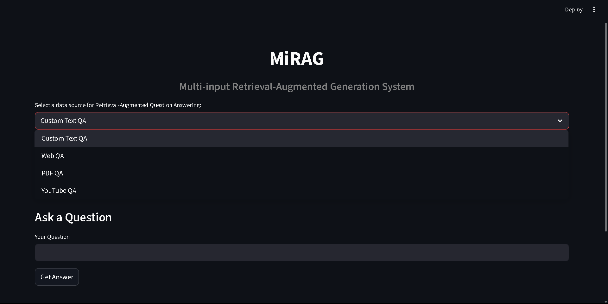
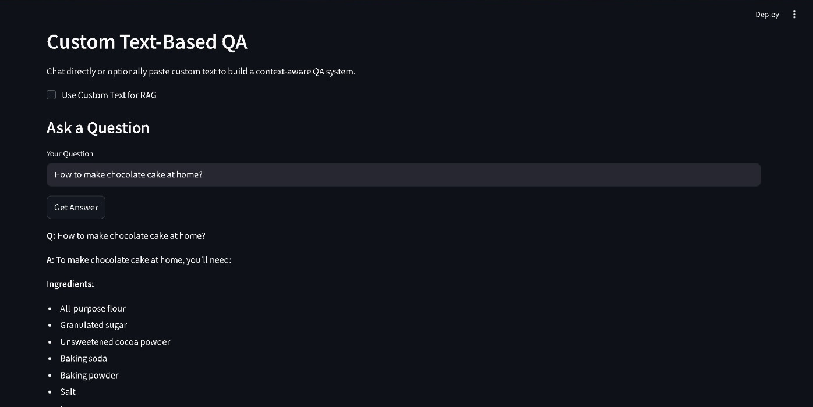
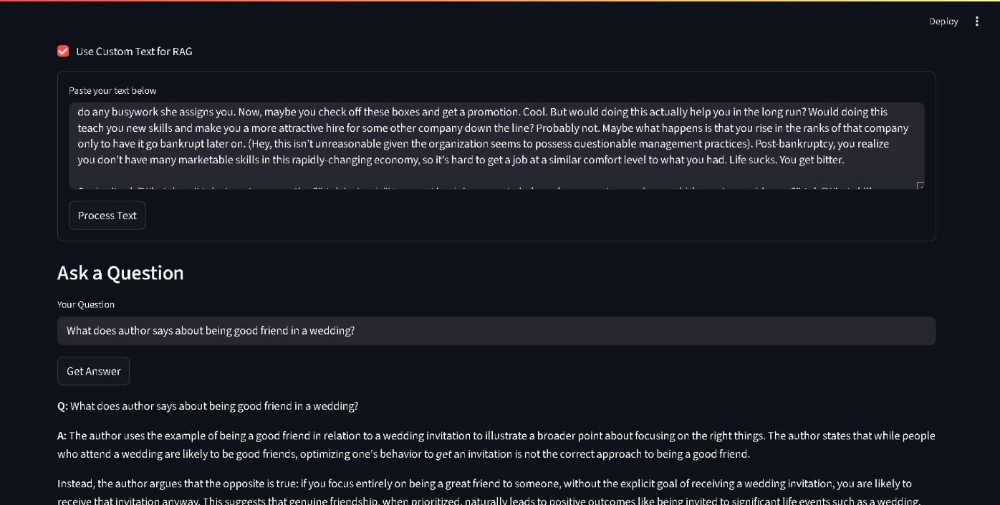
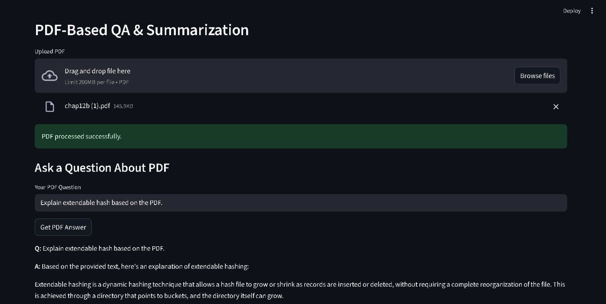
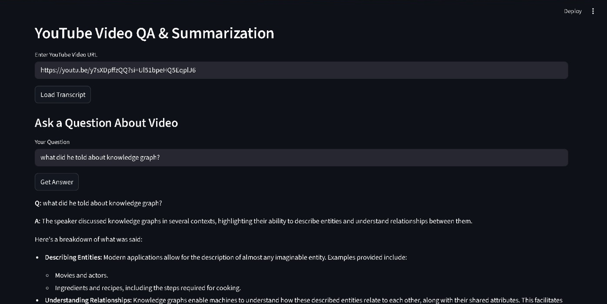
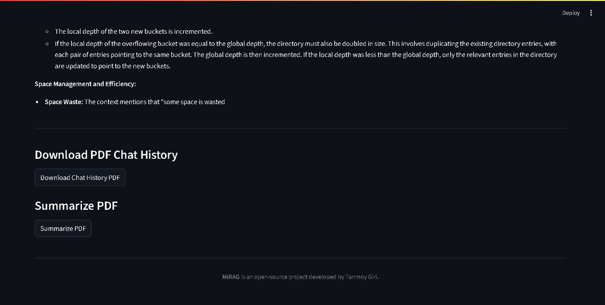
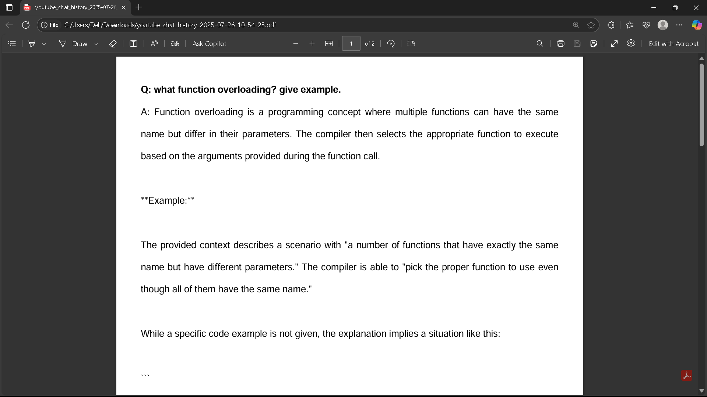

# MiRAG — Multi-input Retrieval-Augmented Generation

**MiRAG** is an interactive, multi-modal application built with Streamlit that leverages Retrieval-Augmented Generation (RAG) to perform question-answering and summarization across various content types:

- 🌐 Web pages  
- 📄 PDF documents  
- 📺 YouTube videos  
- 📝 Custom user input

Built on LangChain, Gemini (Google Generative AI), and FAISS, MiRAG enables users to query unstructured content intelligently and intuitively.

---

## 🚀 Features

### 🔹 Web QA (RAG from URLs)
- Extract and embed content from any public URL (JS and non-JS).
- Perform context-aware question answering and summarization.
- Retain memory across conversation turns.

### 🔹 PDF QA
- Upload any PDF and perform:
  - Contextual Q&A
  - Full-document summarization
  - Chat history export as PDF

### 🔹 YouTube Video QA
- Input any YouTube video URL to fetch its transcript.
- Ask questions and generate a summary.
- Ideal for educational content, lectures, and long-form videos.

### 🔹 Custom Text QA
- Use default chatbot mode or paste your own text block.
- Build a temporary vectorstore and perform RAG on your content.
- Memory support with chat history download.

---

## 🛠️ Tech Stack

- **Python 3.10+**
- **Streamlit** – User Interface
- **LangChain** – Chain and embedding orchestration
- **Google Generative AI (Gemini)** – LLM & embeddings
- **FAISS** – Vectorstore for semantic retrieval
- **YouTube Transcript API** – Transcript extraction
- **FPDF** – PDF generation for exporting chats

---

## 📦 Installation

1. **Clone the repository:**
   ```bash
   git clone https://github.com/iamtgiri/MiRAG.git
   cd MiRAG
   ```

2. **Create a virtual environment:**

   ```bash
   python -m venv .venv
   source .venv/bin/activate   # On Windows: .venv\Scripts\activate
   ```

3. **Install dependencies:**

   ```bash
   pip install -r requirements.txt
   ```

4. **Set environment variable:**

   ```bash
   export GOOGLE_API_KEY=your_api_key_here 
   ```

5. **Run the app:**

   ```bash
   streamlit run app.py
   ```

---

## 📁 Project Structure

```
MiRAG/
├── app.py                      # Main Streamlit app
├── pdf_utils.py                # PDF loading, splitting & summarization
├── process_youtube.py          # YouTube video processing & transcript extraction
├── rag_utils.py                # Utility functions & chain builders
├── requirements.txt
└── README.md
```

---

## 📸 Screenshots

A preview of the MiRAG application in action across different modules:

### 🏠 Home Interface

> Module selection screen and branding



---

### 📝 Custom Text QA

> Normal Q\&A without any context
> 

> Paste custom text, ask questions, and get answers using RAG with memory
> 

---

### 🌐 Web QA

> Enter a URL, extract content, and perform context-aware Q\&A
> 

---

### 📄 PDF QA

> Upload a PDF, ask questions, and download the chat history
> 

---

### 📺 YouTube QA

> Enter a YouTube URL, analyze the transcript, and chat with context
> 

> Summarize the video and export the chat
> 

---

### 📤 Download Chat History

> Export your full conversation as a downloadable PDF
> 


---

## 🧠 Credits

* Built with [LangChain](https://www.langchain.com/)
* Powered by [Google Gemini](https://ai.google.dev/)
* PDF export via [FPDF](https://pyfpdf.github.io/)
* Transcripts via [YouTube Transcript API](https://pypi.org/project/youtube-transcript-api/)

---

## 📄 License

MIT License © 2025 [Tanmoy Giri](https://github.com/iamtgiri) \
See [LICENSE](LICENSE) for details.
